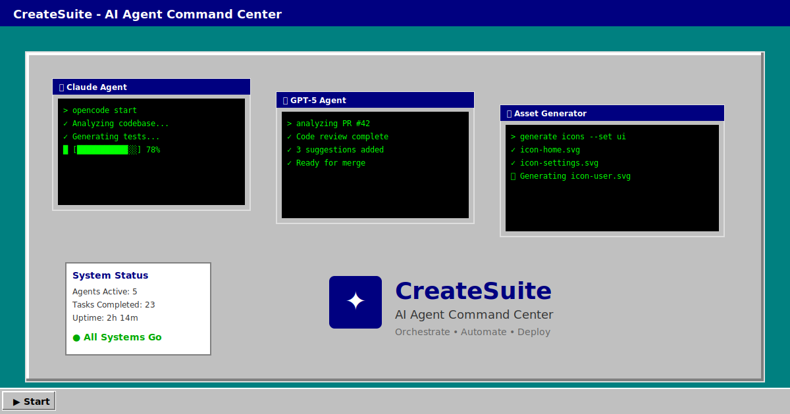

# 🖥️ CreateSuite Agent UI

**Your AI agents deserve a proper command center.**

A nostalgic Windows 95-styled desktop environment for orchestrating AI coding agents. Run Claude, GPT, and other AI assistants in parallel terminal sessions, all from one delightfully retro interface.



## ✨ Features

| Feature | Description |
|---------|-------------|
| 🪟 **Multi-Window Desktop** | Drag, resize, and manage multiple terminal windows |
| 🤖 **Multi-Agent Support** | Run Claude, GPT, Gemini, and more in parallel |
| ⏱️ **Smart Lifecycle** | Auto-shutdown when work completes (saves 💰!) |
| 🎨 **Windows 95 Aesthetic** | Because nostalgia is powerful |
| 🖥️ **Full Terminal** | Real shell with xterm.js + node-pty |
| 🌐 **Deploy Anywhere** | Fly.io, Render, or run locally |

## 🚀 Quick Start

### One Command (Development)

```bash
# In the agent-ui directory
npm install && npm run dev

# In another terminal
cd server && npm install && node index.js
```

Then open **http://localhost:5173** — you'll see a welcome wizard! 🎉

### Keyboard Shortcuts

| Shortcut | Action |
|----------|--------|
| `Ctrl+N` | New Terminal |
| `Ctrl+Shift+N` | Agent Village |
| `Escape` | Close menus |

## 🚢 Deploy to Fly.io

```bash
# First time
fly launch

# Subsequent deploys
./scripts/fly-deploy.sh deploy
```

See [Deployment Guide](../docs/guides/DEPLOY_RENDER.md) for Render and other platforms.

## 🧩 Project Structure

```
agent-ui/
├── src/
│   ├── App.tsx              # Main desktop app
│   ├── components/
│   │   ├── TerminalWindow   # xterm.js terminal
│   │   ├── WelcomeWizard    # First-run experience
│   │   ├── DesktopIcons     # Quick-access icons
│   │   ├── LifecycleNotification  # Auto-shutdown UI
│   │   └── ...
├── server/
│   ├── index.js             # Express + Socket.IO server
│   └── lifecycleManager.js  # Smart container lifecycle
├── public/
│   └── createsuite.svg      # Favicon
└── fly.toml                 # Fly.io config
```

## 🔧 Environment Variables

| Variable | Description | Default |
|----------|-------------|---------|
| `PORT` | Server port | `3001` |
| `ENABLE_PTY` | Enable terminal | `true` |
| `AUTO_SHUTDOWN` | Auto-shutdown when idle | `true` |
| `GRACE_PERIOD_MS` | Grace period before shutdown | `900000` (15 min) |
| `WEBHOOK_URL` | Slack/Discord notifications | - |
| `GITHUB_TOKEN` | For agent-triggered rebuilds | - |
| `FLY_API_TOKEN` | Enable Fly.io agent spawning | - |
| `FLY_APP_NAME` | Fly.io app name for the UI | `createsuite-agent-ui` |
| `FLY_AGENT_APP_PREFIX` | Prefix for per-agent Fly apps | Value of `FLY_APP_NAME` |
| `FLY_ORG` | Fly.io org slug for new apps | - |
| `UI_WEBSOCKET_URL` | WebSocket URL agents connect back to | `wss://<FLY_APP_NAME>.fly.dev` |

## 📖 Documentation

- [Main README](../README.md) - Full CreateSuite documentation
- [Architecture](../docs/architecture/ARCHITECTURE.md) - System design
- [Deployment](../docs/guides/DEPLOY_RENDER.md) - Production deployment

## 🙌 Contributing

PRs welcome! Check out the [development guide](../docs/guides/GETTING_STARTED.md).# Force workflow trigger
